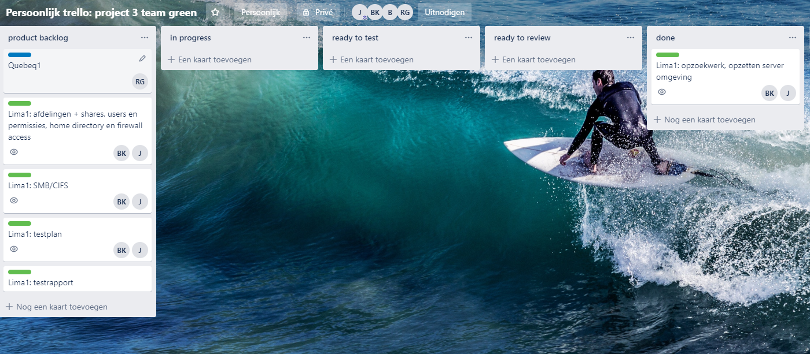
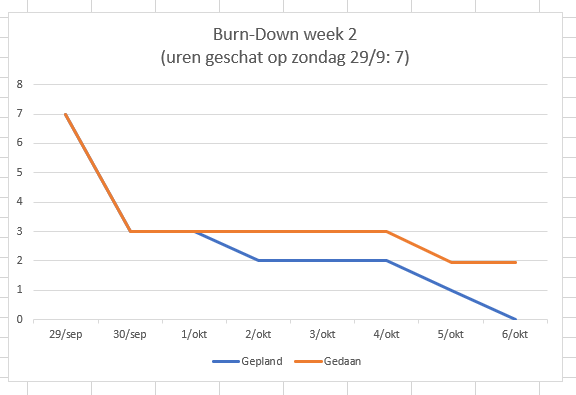
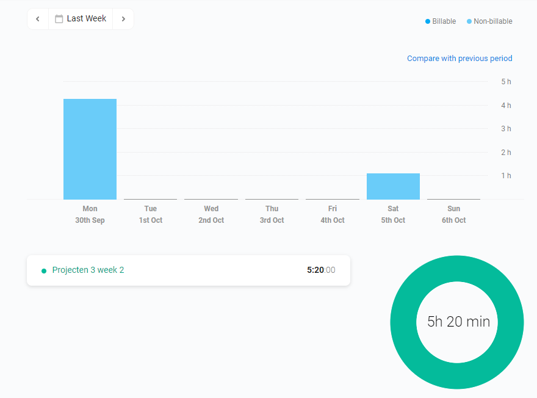

## Rapport week 2
#### 30/09 - 06/10

|         naam         |    aanwezig   |
|:--------------------:|:-------------:|
|    Jonas Spitaels    |        x      |

> Wat er deze week gepresteerd is door mij:

Opzoekwerk omtrent Samba, video bekijken van Bert Van Vreckem omtrent het opzetten hiervoor. Starten met de ansible omgeving te clonen en nader te bekijken.

> Foto's trellobord

foto genomen op einde van week 2

> Foto burndown grafiek

> Uren Jonas Spitaels    

> Links naar gebruikte sites

https://github.com/bertvv/ansible-role-samba
https://galaxy.ansible.com/bertvv/samba
https://github.com/bertvv/ansible-skeleton
https://www.varonis.com/blog/cifs-vs-smb/
https://github.com/hashicorp/vagrant/issues/5059

